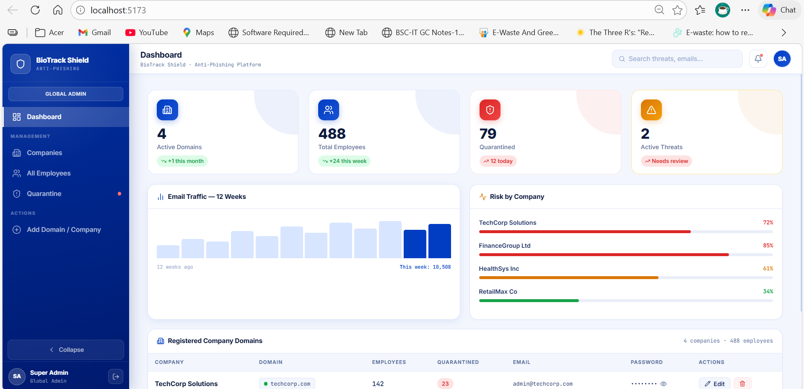
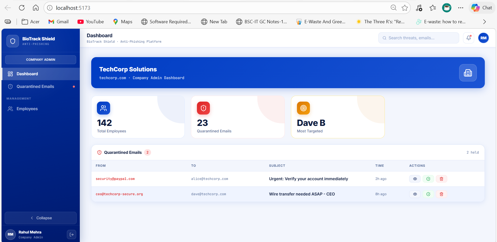
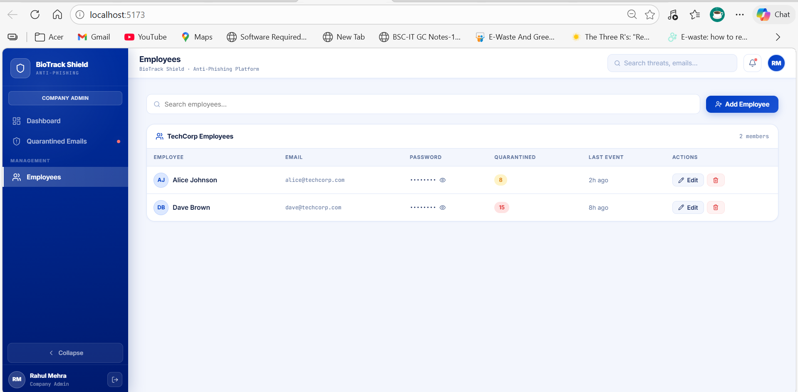
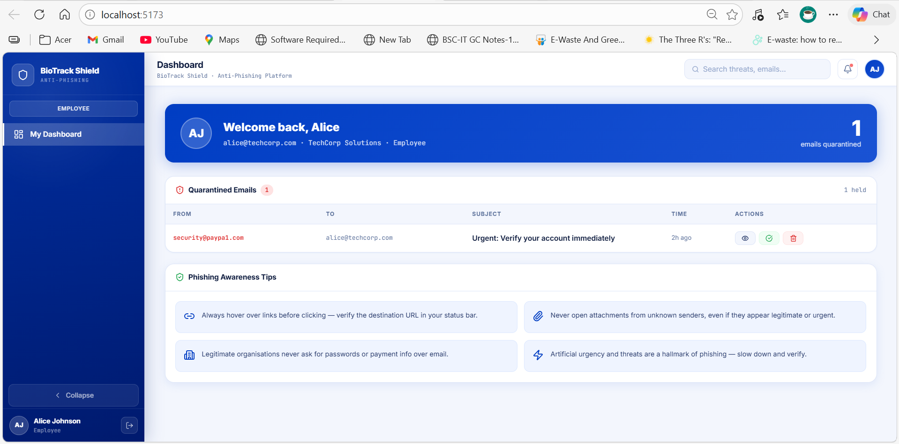
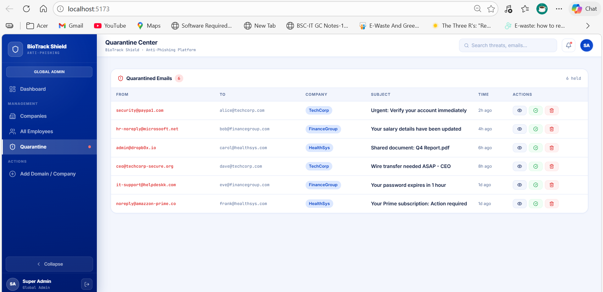

# BioTrack Shield – Simulation & Anti-Phishing Platform

BioTrack Shield is a **cybersecurity dashboard designed for phishing simulation and threat awareness monitoring**.
This project was developed as a **real-time application for Maximus Atlas Pvt Ltd** to help organizations detect phishing risks, monitor employee awareness, and strengthen cybersecurity practices.

The platform enables administrators to **run simulated phishing campaigns, identify vulnerable users, and reinforce safe online behavior across organizations.**

---


## 🚀 Project Overview

Phishing attacks remain one of the **largest cybersecurity threats** for organizations.
BioTrack Shield provides a **centralized interface for monitoring phishing risks and managing employee awareness programs.**

The system allows administrators to:

* Simulate phishing attacks
* Identify employees susceptible to phishing
* Monitor suspicious email activities
* Manage companies and employee accounts
* Track security awareness metrics

This repository contains the **frontend implementation of the BioTrack Shield dashboard**.

---

## ✨ Key Features

### 🔐 Global Admin Dashboard

* Monitor all companies using the platform
* View phishing threat statistics
* Track security events across organizations

### 🏢 Company Management

* Manage company domains
* Add or remove organizations
* Track phishing risk indicators

### 👥 Employee Management

* View employees across companies
* Track phishing awareness metrics
* Password visibility toggle
* Edit or remove employee records

### 📧 Email Quarantine Monitoring

* Detect suspicious or phishing emails
* Track quarantined messages
* Analyze potential phishing attempts

### 📊 Security Awareness Tracking

* Monitor phishing simulation results
* Identify high-risk users
* Measure employee awareness levels

---

## 📸 Dashboard Screenshots

### Global Admin Dashboard


### Company Admin Dashboard


### Company Admin Employees


### Employee Dashboard


### Email Quarantine Monitoring


---


## 🖥️ Tech Stack

Frontend technologies used:

* **React.js**
* **Vite**
* **JavaScript (ES6+)**
* **CSS / Custom UI Styling**
* **Lucide React Icons**

---

## 📂 Project Structure

```
src
│
├── components
│   ├── companies
│   ├── employees
│   ├── quarantine
│   └── dashboard
│
├── pages
│   ├── GlobalAdmin
│   ├── CompanyAdmin
│   └── Employee
│
├── data
│   └── mockData.js
│
├── hooks
│
└── styles
```

---

## ⚙️ Installation

Clone the repository:

```
git clone https://github.com/yourusername/biotrack-shield-antiphishing.git
```

Navigate to the project directory:

```
cd biotrack-shield-antiphishing
```

Install dependencies:

```
npm install
```

Run the development server:

```
npm run dev
```

Application will start at:

```
http://localhost:5173
```

---

## 📊 Dashboard Modules

| Module         | Description                             |
| -------------- | --------------------------------------- |
| Dashboard      | Security overview and threat statistics |
| Companies      | Manage organization domains             |
| Employees      | Manage employee accounts                |
| Quarantine     | Monitor suspicious or phishing emails   |
| Admin Controls | Administrative security management      |

---

## 🔒 Security Concept

The platform focuses on **phishing awareness training and threat monitoring** through:

* Phishing attack simulations
* Suspicious email detection
* Employee vulnerability analysis
* Security awareness tracking

---

## 👩‍💻 Developer

**Nandini Choudhary**

MCA Student
Cybersecurity & Software Development Enthusiast

---
